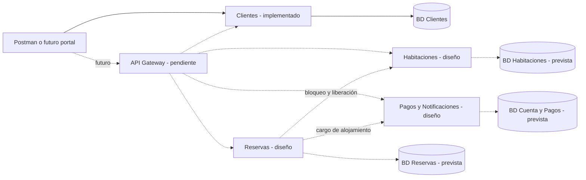
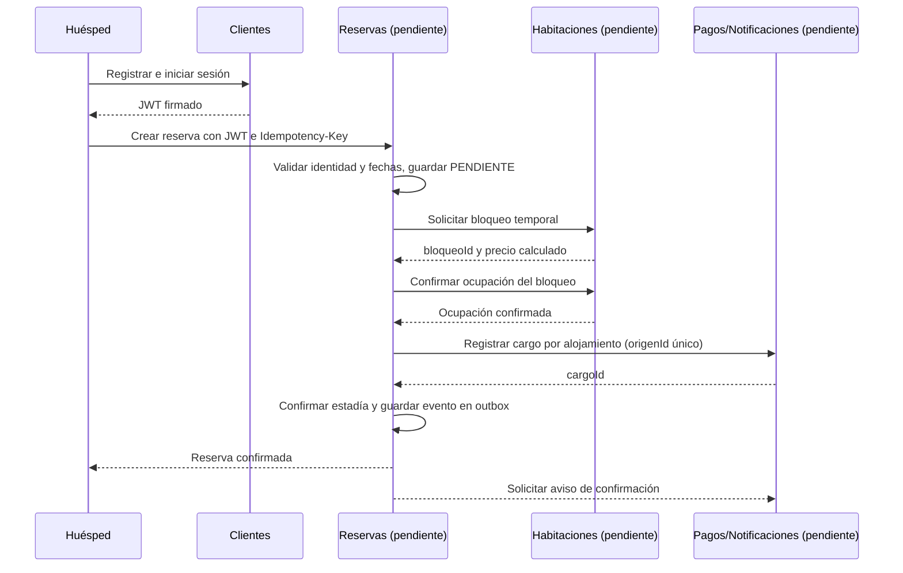

# Arquitectura SOA del Hotel Resort

## Estado actual y objetivo

Solo Clientes se ejecuta en esta versión. Los otros tres servicios tienen responsabilidades y contratos preliminares. El repositorio agrupa el código del equipo, pero cada servicio debe tener su proceso, sus reglas y la propiedad de sus datos. Usar un monorepositorio no significa mezclar las bases ni la lógica.

Las líneas continuas muestran componentes existentes; las punteadas, conexiones previstas. El Gateway no contará como uno de los cuatro servicios de negocio ni contendrá reglas de reservas.

## Límites de los servicios

| Servicio               | Datos propios                                            | Operaciones                                                      | No debe hacer                                         |
| ---------------------- | -------------------------------------------------------- | ---------------------------------------------------------------- | ----------------------------------------------------- |
| Clientes               | Huéspedes y credenciales                                 | Registrar, autenticar, consultar perfil propio                   | Gestionar reservas o saldos                           |
| Habitaciones           | Habitaciones, tarifas, bloqueos y ocupaciones por fechas | Consultar disponibilidad, bloquear, confirmar/liberar inventario | Editar reservas o procesar cobros                     |
| Reservas               | Estadías, fechas, estado, referencias y precio acordado  | Coordinar reserva, consultar y cancelar                          | Consultar directamente tablas de Habitaciones o Pagos |
| Pagos / Notificaciones | Cargos, pagos y avisos                                   | Consolidar cuenta, cobrar y registrar confirmaciones             | Decidir disponibilidad o modificar estadías           |

Cada base tendrá su usuario. El Compose actual crea exclusivamente la de Clientes; no contiene bases vacías que aparenten servicios implementados. Pagos y Notificaciones se agrupan por alcance académico, con módulos separados cuando se implementen.

## Contratos comunes

- REST/JSON y prefijo `/api/v1`. UUID como identificadores, fechas ISO 8601.
- Error uniforme: `{codigo, mensaje, detalle, traceId}`.
- JWT RS256 de 15 minutos: `sub=clienteId`, `rol=HUESPED`, `iss=resort-clientes`, `aud=resort-api`.
- Solo Clientes conserva la clave privada; los consumidores verifican claves públicas obtenidas de JWKS.
- Los endpoints internos requerirán identidad de servicio. El JWT de un huésped no sustituye ese control.
- Reservas y pagos usarán `Idempotency-Key`, persistiendo resultado y huella del cuerpo. Una misma clave con otro cuerpo debe dar 409. Esto está diseñado, no implementado en Clientes.
- Importes propuestos como cadenas decimales (`"660.00"`) en los nuevos contratos para evitar pérdida de precisión en JSON/JavaScript. Actualizar esta convención en el informe del equipo antes de integrar.

## Flujo previsto de reserva sin anticipo

Esta primera propuesta confirma la reserva con cargo pendiente y cobra al finalizar la estadía. El informe original contempla pago al reservar cuando corresponda; el equipo debe elegir y documentar una política antes de implementar Reservas.

El diagrama de secuencia es diseño, no evidencia de integración ejecutada.

## Consistencia y fallos por resolver en la siguiente fase

- Habitaciones debe evitar solapamientos dentro de una transacción. No basta consultar y luego insertar sin protección. Diseñar rangos `[entrada, salida)` para permitir salida y entrada el mismo día.
- Si falla un paso después del bloqueo, Reservas debe recuperar su estado y liberar/compensar lo confirmado. Si ya creó el cargo, la compensación debe anularlo sin borrar su historial.
- Si se desconoce si una llamada terminó, consultar/reintentar de forma idempotente; no asumir que un timeout implica que nada ocurrió.
- Timeout previsto: 3 segundos por dependencia; reintentos limitados solo en operaciones seguras o idempotentes. No mantener una transacción de base abierta durante una llamada HTTP.
- Un aviso fallido no cancela una reserva confirmada. Se reintenta con una cola/outbox persistente; no confiar en tareas solo en memoria.
- El flujo de pago con anticipo requiere autorización/captura y reverso con una pasarela de prueba; está fuera de este primer servicio.

## Ampliación al escenario del resort

Restaurante y Spa/Actividades se incorporarán después de los cuatro servicios base. Registrarán hechos de consumo propios y enviarán cargos a Pagos con `reservaId`, `origen` y `origenId`. Una restricción única sobre el origen evitará duplicar cargos. Estos dos dominios no forman parte de la implementación actual.
